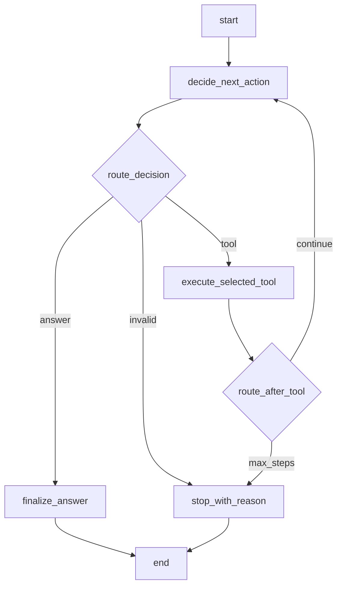

# V4: LangGraph Agent 规划

## 目标

V4 的目标是把 V3 已经跑通的 Agent 循环迁移到 LangGraph 编排。

V4 不新增工具，不重写工具层，不替换 V3 的 `--ask-mode agent`。本阶段新增一个独立入口：

```text
--ask-mode graph
```

这样 V3 和 V4 可以并存：

```text
--ask-mode agent  -> V3 run_agent_loop
--ask-mode graph  -> V4 LangGraph workflow
```

## 为什么这样做

V3 已经证明了完整链路：

```text
用户问题
-> LLM 生成 JSON decision
-> parse_llm
-> run_agent_loop
-> execute_tool
-> history
-> LLM 基于 history 继续回答
```

V4 不应该同时引入太多变量。先只替换编排层，可以清楚学习和验证 LangGraph 的核心概念：

1. `StateGraph`
2. state
3. node
4. edge
5. conditional edge
6. 工具执行节点
7. 循环控制
8. 最大步数限制

## 范围

### 本阶段要做

1. 新增 LangGraph 版 Agent workflow。
2. 新增 `--ask-mode graph`。
3. 复用 V3 的 LLM decision 协议。
4. 复用 V3 的工具注册表和工具执行函数。
5. 保持 `--ask-mode agent` 行为不变。
6. 为 graph 模式补充独立测试。
7. 更新 README 或 V4 文档中的使用命令。

### 本阶段不做

1. 不实现 `retrieve_code`。
2. 不新增工具。
3. 不引入长期 memory。
4. 不做 checkpoint 持久化。
5. 不改变搜索范围智能判断逻辑。
6. 不删除或替换 V3 的 `run_agent_loop`。
7. 不重构已有 RAG 模块。

## 建议文件结构

```text
src/agent/state.py
src/agent/nodes.py
src/agent/graph.py
```

### `src/agent/state.py`

负责定义 LangGraph 运行时 state。

建议状态字段：

```python
class AgentGraphState(TypedDict):
    question: str
    repo_path: str
    allowed_tools: list[str]
    history: list[dict[str, object]]
    decision: dict[str, object]
    tool_result: dict[str, object]
    answer: str
    status: str
    reason: str
    step_count: int
    max_steps: int
```

字段含义：

1. `question`：用户问题。
2. `repo_path`：当前分析的仓库路径。
3. `allowed_tools`：允许 LLM 调用的工具名列表。
4. `history`：决策和工具结果历史。
5. `decision`：当前 LLM 决策。
6. `tool_result`：最近一次工具执行结果。
7. `answer`：最终回答。
8. `status`：`completed` 或 `stopped`。
9. `reason`：停止原因。
10. `step_count`：已经执行的工具步数。
11. `max_steps`：最大工具步数。

### `src/agent/nodes.py`

负责定义 LangGraph 节点。

建议节点：

```text
decide_next_action
execute_selected_tool
finalize_answer
stop_with_reason
```

#### `decide_next_action`

输入当前 state，调用 V3 已有的 `llm_decision_func`。

这个节点负责：

1. 构造 LLM context。
2. 调用 LLM decision 函数。
3. 校验 decision payload。
4. 把 decision 写入 state。
5. 如果 decision 无效，把 `status` 设置为 `stopped`，并写入 `reason`。

#### `execute_selected_tool`

输入当前 state，执行工具。

这个节点负责：

1. 从 `decision` 读取 `tool_name` 和 `arguments`。
2. 统一给工具参数注入 `repo_path`。
3. 调用 V3 已有的 `execute_tool()`。
4. 把 decision 写入 history。
5. 把 tool_result 写入 history。
6. 递增 `step_count`。

#### `finalize_answer`

当 LLM decision 是 `answer` 时执行。

这个节点负责：

1. 从 decision 中取出 answer。
2. 设置 `status = "completed"`。
3. 写入最终回答。

#### `stop_with_reason`

当流程需要停止但没有最终回答时执行。

常见情况：

1. LLM 返回非法 decision。
2. 达到 `max_steps`。
3. 路由阶段发现未知状态。

### `src/agent/graph.py`

负责组装 LangGraph。

对外提供统一入口：

```python
def run_agent_graph(
    question: str,
    repo_path: str,
    llm_decision_func: Callable[[dict[str, object]], dict[str, object]],
    max_steps: int = 3,
) -> dict[str, object]:
    ...
```

返回结构尽量和 V3 `run_agent_loop()` 对齐：

```python
{
    "status": "completed" | "stopped",
    "answer": "...",
    "reason": "...",
    "history": [...]
}
```

这样 CLI 和测试可以复用同一类断言。

## Graph 流程

建议流程：

```text
start
-> decide_next_action
-> route_decision
   -> answer: finalize_answer -> end
   -> tool: execute_selected_tool -> route_after_tool
      -> continue: decide_next_action
      -> max_steps: stop_with_reason -> end
   -> invalid: stop_with_reason -> end
```

对应 Mermaid 图：



## CLI 设计

V4 新增一个模式：

```powershell
python src/main.py --repo E:\projects\codebase-agent --ask-mode graph --ask "请搜索 run_agent_loop，并告诉我它在哪个文件里" --max-steps 4
```

V3 命令保持不变：

```powershell
python src/main.py --repo E:\projects\codebase-agent --ask-mode agent --ask "请搜索 run_agent_loop，并告诉我它在哪个文件里" --max-steps 4
```

预期两者在基础问题上给出相同或接近的结果，但 history 的内部实现来源不同：

```text
agent: Python for loop
graph: LangGraph StateGraph
```

## 测试计划

### Graph 单元测试

建议新增：

```text
tests/test_agent_graph.py
```

测试场景：

1. LLM 直接返回 answer，graph 返回 `completed`。
2. LLM 先返回 tool，再返回 answer，graph 返回 `completed`。
3. 工具调用会自动注入 `repo_path`。
4. 工具执行结果会写入 history。
5. 达到 `max_steps` 后返回 `stopped`。
6. LLM 返回非法 decision 后返回 `stopped`，并包含 reason。
7. 未知工具不会导致程序崩溃，而是通过 tool_result 表达失败。

### CLI 测试

建议更新：

```text
tests/test_main_cli.py
```

覆盖：

1. `--ask-mode graph` 会调用 `run_agent_graph()`。
2. graph 模式输出 `Agent Status`。
3. graph 模式输出最终回答。
4. graph 模式输出 history。

### 回归测试

实现完成后必须确认：

```powershell
python -m unittest discover -s tests
```

并且确认 V3 agent 模式测试仍然通过。

## 依赖处理

实现前需要检查项目中是否已经声明 LangGraph 依赖。

如果没有，需要在依赖文件中加入：

```text
langgraph
```

如果当前环境没有安装依赖，实现阶段应先确认安装方式，而不是在规划阶段直接修改环境。

## 验收标准

V4 完成时应满足：

1. `--ask-mode graph` 可用。
2. `--ask-mode agent` 仍然可用。
3. graph 模式能完成至少一次工具调用再回答。
4. graph 模式能处理直接回答。
5. graph 模式能处理非法 decision。
6. graph 模式能处理 `max_steps`。
7. graph 模式复用 V3 的 `repo_summary`、`read_file`、`search_code`。
8. 单元测试覆盖 graph 核心流程。
9. 全量测试通过。

## 推荐实施顺序

1. 检查 LangGraph 依赖是否存在。
2. 写 `tests/test_agent_graph.py`，先用 fake LLM 驱动 graph 行为。
3. 新增 `src/agent/state.py`。
4. 新增 `src/agent/nodes.py`。
5. 新增 `src/agent/graph.py`。
6. 跑 graph 单元测试。
7. 在 CLI 中加入 `--ask-mode graph`。
8. 更新 CLI 测试。
9. 跑全量测试。
10. 更新 README 使用说明。

## 风险与控制

### 风险 1：一次性改动过大

控制方式：V4 不替换 V3，只新增 graph 模式。

### 风险 2：LangGraph 状态字段过多导致混乱

控制方式：state 字段先和 V3 返回结构、history、step_count 对齐，不提前加入 memory、checkpoint、retrieved_chunks。

### 风险 3：测试难以稳定

控制方式：核心测试继续使用 fake LLM，不依赖真实模型输出。

### 风险 4：依赖未安装

控制方式：实现前先检查依赖文件和当前环境。如果缺失，单独处理依赖变更。

## V4 完成后的下一步

V4 完成后，再考虑 V5 或 V4.1：

1. 把 `retrieve_code` 接入 Agent 工具。
2. 让 Agent 在 `search_code` 和 `retrieve_code` 之间选择。
3. 引入 LangGraph checkpoint。
4. 优化工具调用 history 的可读性。
5. 做更强的代码定位和多文件分析。


---

## V4 Implementation Record

Current V4 keeps V3 `--ask-mode agent` unchanged and adds a new CLI mode:

```text
--ask-mode graph
```

### Implemented Files

1. `src/agent/state.py`
   - Defines `AgentGraphState`.
2. `src/agent/nodes.py`
   - Defines `decide_next_action`.
   - Defines `execute_selected_tool`.
   - Defines `route_after_decision`.
   - Defines `route_after_tool`.
3. `src/agent/graph.py`
   - Builds a LangGraph `StateGraph`.
   - Exposes `build_agent_graph()`.
   - Exposes `run_agent_graph()`.
4. `src/main.py`
   - Adds `--ask-mode graph`.
5. `requirements.txt`
   - Adds `langgraph`.
6. Tests
   - Adds `tests/test_agent_nodes.py`.
   - Adds `tests/test_agent_graph.py`.
   - Updates `tests/test_main_cli.py`.

### Current Graph Flow

```text
start
-> decide_next_action
   -> route_after_decision
      -> end
      -> execute_selected_tool
         -> route_after_tool
            -> decide_next_action
            -> end
```

The core conditional edges are:

```python
workflow.add_conditional_edges(
    "decide_next_action",
    route_after_decision,
    {
        "tool": "execute_selected_tool",
        "end": END,
    },
)

workflow.add_conditional_edges(
    "execute_selected_tool",
    route_after_tool,
    {
        "decision": "decide_next_action",
        "end": END,
    },
)
```

### Manual Verification Command

Run from the project root with the `CodeBaseAgent` environment:

```powershell
E:\anaconda\envs\CodeBaseAgent\python.exe src/main.py `
  --repo E:\projects\codebase-agent `
  --ask-mode graph `
  --ask "请搜索 run_agent_loop，并告诉我它在哪个文件里" `
  --max-steps 3
```

### Manual Verification Result

The command completed successfully:

```text
## Agent Status
completed

## 回答
根据搜索结果，run_agent_loop 函数定义在 src/agent/controller.py 文件的第 9 行。

## History
- decision: tool_name = search_code
- tool_result: search_code matched src/agent/controller.py:9 def run_agent_loop(
```

This verifies the V4 graph path:

```text
user question
-> LangGraph decide_next_action
-> LLM returns tool decision
-> route_after_decision selects execute_selected_tool
-> execute_selected_tool runs search_code
-> route_after_tool loops back to decide_next_action
-> LLM returns final answer from history
-> status = completed
```

### Automated Verification

```powershell
E:\anaconda\envs\CodeBaseAgent\python.exe -m unittest discover -s tests
```

Result:

```text
Ran 84 tests
OK
```
